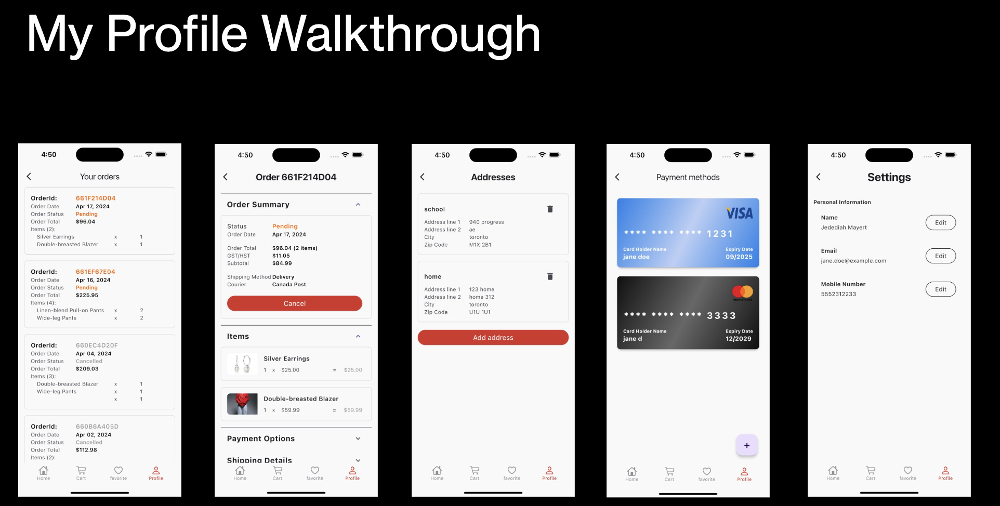

# Fashion Fusion

Fashion Fusion - an iOS mobile app for women’s clothing shopping in the Greater Toronto Area (GTA). It features 5 selections of women’s clothing categories, including Tops, Bottoms, Dresses, Hoodies & Sweats, Accessories, that our client focuses on. Shoppers can expect a straightforward and user-friendly interface, with features such as personalized favorites, smart search suggestions, smart chatbot, order and payment, order tracking and details. The clothing store owner can manage clothing products through the admin portal. The app will be developed on iOS platform using Flutter, MongoDB, and Node.js and will be managed using JIRA for tracking progress, status reports, user stories, and defect tickets. 


## 🛠 Skills
Dart, Flutter, Figma, NodeJs, MongoDB,Firebase...


## Demo


<br>


<br>



<br>


<br>


<br>


<br>

## Installation

Install project with flutter pub get:

```bash
 flutter pub get
```
Run the frontend:
- Press Run -> Run without Debugging -> Choose Simulator

Run the backend REST API:

```bash
 cd api

 node index.js
```
    
## Related

Here are some related projects

[Awesome README](https://github.com/matiassingers/awesome-readme)


## Used By

This project is used by the following companies:

- Centennial College


